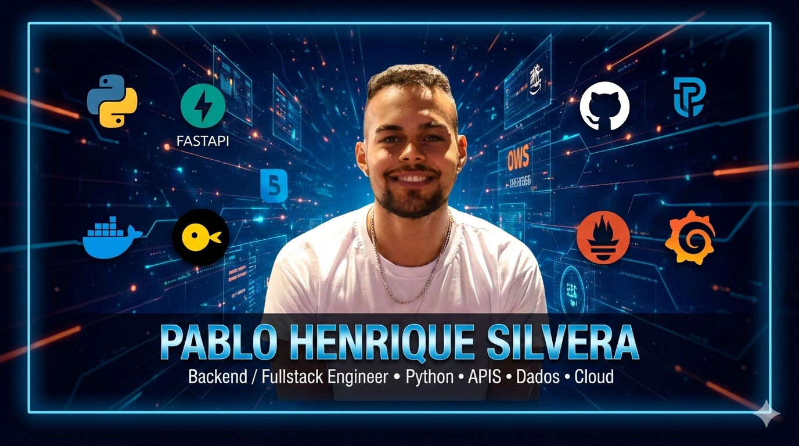

<!-- ===================================================== -->
<!--                        HERO                           -->
<!-- ===================================================== -->

  

<h2 align="left"> <strong> Contruindo com propósito </strong></h2>

<!-- ===================================================== -->
<!--                    TRANSFORMANDO                      -->
<!-- ===================================================== -->

<h3>🚀 Transformando problemas em soluções escaláveis</h3>

Backend focado em APIs robustas, arquitetura limpa e sistemas orientados a dados.
Experiência com ambientes corporativos críticos e cultura de produção.

 

<!-- ===================================================== -->
<!--                       SOBRE MIM                       -->
<!-- ===================================================== -->

<h2>🧠 Sobre mim</h2>

<ul>
  <li><strong>Atuação:</strong> Backend & Full Stack Engineer</li>
  <li><strong>Especialidade:</strong> APIs escaláveis, microsserviços e integração</li>
  <li><strong>Infra & DevOps:</strong> AWS, Docker e CI/CD</li>
  <li><strong>Observabilidade:</strong> Prometheus & Grafana</li>
  <li><strong>Arquitetura:</strong> Clean Architecture & boas práticas</li>
</ul>

 

<pre>
const pablo = {
  cargo: "Software Engineer | Backend & Full Stack",
  foco: ["APIs robustas", "Performance", "Cloud", "Observabilidade"],
  stack: ["Python", "FastAPI", "PostgreSQL"],
  ambiente: "Sistemas corporativos críticos",
  objetivo: "Construir soluções escaláveis e orientadas a métricas"
}
</pre>

<!-- ===================================================== -->
<!--                    VISÃO GERAL GITHUB                  -->
<!-- ===================================================== -->

<!-- VISÃO GERAL DO GITHUB -->
<h2>📊 Visão Geral do GitHub</h2>

  <!-- GitHub Stats -->
  

  <!-- Top Languages -->
  

 

  <!-- GitHub Streak -->
  

<!-- ===================================================== -->
<!--                    STACK TECNOLÓGICA                  -->
<!-- ===================================================== -->

<h2>🧩 Stack tecnológica</h2>

<h3>💻 Linguagens</h3>

  

<h3>⚙ Backend & Arquitetura</h3>

  

<h3>🗄 Banco de dados</h3>

  

<h3>☁ Cloud, DevOps & Ferramentas</h3>

  

<!-- ===================================================== -->
<!--                  MEUS DIFERENCIAIS                    -->
<!-- ===================================================== -->

<h2>✨ Meus Diferenciais</h2>

<table>
<tr>
  <th>Característica</th>
  <th>Aplicação Prática</th>
</tr>
<tr>
  <td>Engenharia Orientada a Produção</td>
  <td>Sistemas preparados para escala e monitoramento</td>
</tr>
<tr>
  <td>Decisão Baseada em Métricas</td>
  <td>Uso de logs, métricas e observabilidade real</td>
</tr>
<tr>
  <td>Arquitetura Limpa</td>
  <td>Separação clara de responsabilidades</td>
</tr>
<tr>
  <td>Resiliência Profissional</td>
  <td>Entrega consistente sob pressão</td>
</tr>
</table>

<!-- ===================================================== -->
<!--                 ATIVIDADE & GRÁFICOS                  -->
<!-- ===================================================== -->

<h2>📊 Atividade & Contribuições</h2>

  

<!-- ===================================================== -->
<!--               PROJETOS EM DESTAQUE                    -->
<!-- ===================================================== -->

<h2>🚀 Projetos em Destaque</h2>

 

  <table width="100%" cellspacing="20">
    <tr>
      <td width="50%" valign="top">

  <h3>🦆 DuckDB Analytics API</h3>
  
  
<strong>Stack:</strong> 
  FastAPI • DuckDB • Prometheus • Grafana • Docker
  

  
  

  API orientada a métricas com foco em performance e observabilidade.
  Monitoramento de latência em tempo real e arquitetura pronta para produção.
  

  
  

  <a href="https://github.com/PabloHSO/duckdb-analytics-api">
    🔗 Ver Repositório
  </a>
  

  </td>

  <td width="50%" valign="top">

<h3>🍔 Delivery System API</h3>

<strong>Stack:</strong> 
FastAPI • SQLAlchemy • JWT • Pytest

Backend completo com autenticação JWT, arquitetura limpa
e cobertura de testes automatizados.

<a href="https://github.com/PabloHSO/delivery-api">
  🔗 Ver Repositório
</a>

  </td>
  </tr>
  </table>

<!-- ===================================================== -->
<!--                  OPORTUNIDADES                        -->
<!-- ===================================================== -->

## 💼 Oportunidades

Estou aberto a oportunidades como:

- Backend Engineer  
- Software Engineer  
- Backend & Full Stack Developer  

📍 Disponível para trabalho **Remoto**

Busco projetos desafiadores onde possa contribuir com arquitetura sólida, escalabilidade e qualidade de código.

---

<!-- ===================================================== -->
<!--                        CONTATO                        -->
<!-- ===================================================== -->

## 🤝 Contato

 

  

---

  <strong>Construindo soluções com propósito.</strong>

