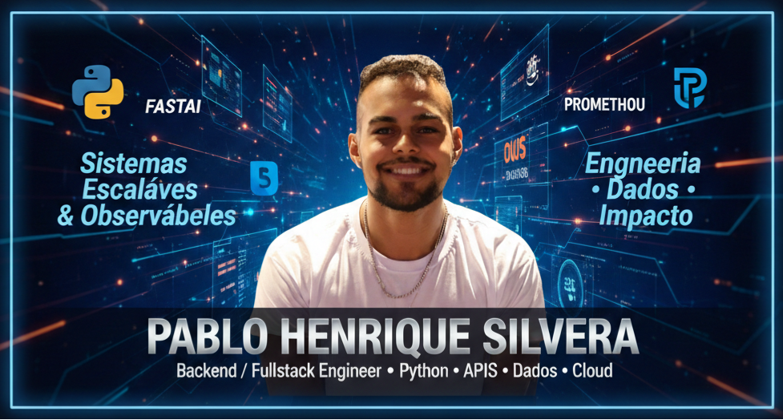

<!-- ===================== -->
<!--        BANNER         -->
<!-- ===================== -->

  

<h1 align="center">Pablo Henrique Silveira</h1>

  <b>Backend / Fullstack Engineer</b> 
  Python • APIs • Data • Cloud • Observability

  
  
  

<!-- ===================== -->
<!--      QUICK SUMMARY    -->
<!-- ===================== -->

<h2>🧭 Resumo Profissional</h2>

<ul>
  <li>💻 <b>Atuação:</b> Backend & Fullstack Engineer</li>
  <li>📊 <b>Especialidade:</b> APIs, Dados, Observabilidade</li>
  <li>☁️ <b>Ambiente:</b> Cloud AWS & Docker</li>
  <li>🏦 <b>Experiência:</b> Sistemas críticos em ambiente corporativo (Itaú)</li>
</ul>

<!-- ===================== -->
<!--    CORE STACK         -->
<!-- ===================== -->

<h2>🧰 Core Backend Stack</h2>

  
  
  
  
  

<!-- ===================== -->
<!--   DATA & ANALYTICS    -->
<!-- ===================== -->

<h2>📊 Data, Analytics & Observability</h2>

  
  
  
  

  
  
  

<!-- ===================== -->
<!--   CLOUD & DEVOPS      -->
<!-- ===================== -->

<h2>☁️ Cloud, DevOps & Infra</h2>

  
  
  
  

  
  

<!-- ===================== -->
<!--   FRONTEND            -->
<!-- ===================== -->

<h2>🎨 Frontend & Web</h2>

  
  
  
  
  

<!-- ===================== -->
<!--   QUALITY             -->
<!-- ===================== -->

<h2>🧪 Qualidade & Arquitetura</h2>

  
  
  
  

<!-- ===================== -->
<!--   PROJECTS            -->
<!-- ===================== -->

<h2>⭐ Projetos em Destaque</h2>

<h3>🦆 DuckDB Analytics API</h3>

<ul>
  <li>FastAPI + DuckDB (OLAP Embedded)</li>
  <li>Métricas reais e latência P95</li>
  <li>Observabilidade com Prometheus & Grafana</li>
  <li>Docker + CI/CD</li>
</ul>

  🔗 <a href="https://github.com/PabloHSO/duckdb-analytics-api">Repositório</a>| 
  🌐 <a href="https://pablohso.github.io/duckdb-analytics-api/">GitHub Pages</a>

 

<h3>🍔 Delivery System API</h3>

<ul>
  <li>FastAPI + SQLAlchemy</li>
  <li>JWT Authentication</li>
  <li>CRUD completo</li>
  <li>Testes automatizados</li>
</ul>

  🔗 <a href="https://github.com/PabloHSO/delivery-api">Repositório</a> |
  🌐 <a href="https://pablohso.github.io/delivery-api/">GitHub Pages</a>

<!-- ===================== -->
<!--   STATS               -->
<!-- ===================== -->

<h2>📊 GitHub Numbers</h2>

  <picture>
    <source
      srcset="https://github-readme-stats.vercel.app/api?username=PabloHSO&show_icons=true&rank_icon=github&custom_title=Pablo%20GitHub%20Stats&theme=one_dark_pro"
      media="(prefers-color-scheme: dark)"
    />
    <source
      srcset="https://github-readme-stats.vercel.app/api?username=PabloHSO&show_icons=true&rank_icon=github&custom_title=Pablo%20GitHub%20Stats"
      media="(prefers-color-scheme: dark), (prefers-color-scheme: no-preference)"
    />
    
  </picture>

  <picture>
    <source
      srcset="https://github-readme-stats.vercel.app/api/top-langs/?username=PabloHSO&layout=compact&theme=one_dark_pro"
      media="(prefers-color-scheme: dark)"
    />
    <source
      srcset="https://github-readme-stats.vercel.app/api/top-langs/?username=PabloHSO&layout=compact"
      media="(prefers-color-scheme: dark), (prefers-color-scheme: no-preference)"
    />
     
  </picture>

<!-- ===================== -->
<!--   CONTACT             -->
<!-- ===================== -->

<h2>📫 Contato</h2>

<ul>
  <li>📧 <b>Email:</b> pablohenriques0603@gmail.com</li>
  <li>💼 <a href="https://linkedin.com/in/pablohsilveira">LinkedIn</a></li>
  <li>🐙 <a href="https://github.com/PabloHSO">GitHub</a></li>
</ul>

  <i>Construindo sistemas que unem engenharia, dados e impacto real.</i>

